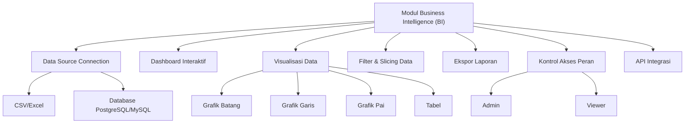

# RANTAI BUSI

Selamat datang di repository modul Business Intelligence (BI), bagian dari platform analytics end-to-end yang dirancang untuk mengubah data mentah menjadi wawasan bisnis yang dapat digunakan secara langsung. Modul ini menyediakan dashboard interaktif dan laporan real-time untuk mendukung pengambilan keputusan berbasis data.

---

## Tentang

Modul BI menyediakan dashboard dinamis dan alat pelaporan lengkap yang memungkinkan pengguna memantau indikator kinerja utama (KPI), mengikuti tren bisnis, dan membuat laporan yang dapat dikustomisasi. Modul ini berintegrasi mulus dengan modul Exploratory Data Analysis (EDA) untuk memberikan insight visual yang bersih dan mudah dipahami bagi pemangku kepentingan bisnis.

> Visi: Menjadi solusi BI yang skalabel, mudah digunakan, dan real-time yang mendorong keputusan bisnis yang lebih cerdas di semua tingkatan organisasi.

---

## Fitur

- Terhubung ke berbagai sumber data (file CSV, database PostgreSQL/MySQL)

- Visualisasi interaktif: grafik batang, garis, pai, dan tabel

- Dashboard kustom dengan fitur drag-and-drop

- Filter dan slicing data secara real-time

- Ekspor laporan dalam format PDF/PNG

- Kontrol akses berbasis peran (Admin dan Viewer)

- API siap integrasi untuk modul turunannya



---

## Instalasi

Prasyarat
- Node.js versi 18 ke atas

- Docker (opsional untuk deployment container)

- Database PostgreSQL atau MySQL

Langkah Instalasi
1. Clone repository ini:
```bash
git clone https://github.com/your-org/bi-module.git
cd bi-module
```

2. Instal semua dependensi:
```bash
npm install
```

3. Sesuaikan konfigurasi koneksi database pada file .env

4. Jalankan aplikasi:
```bash
npm start
```
Atau jalankan dengan Docker:
```bash
docker-compose up
```

## Penggunaan

- Akses dashboard BI pada https://rantai-busi.streamlit.app/

- Hubungkan sumber data dan buat dashboard sesuai kebutuhan

- Simpan dan bagikan laporan kepada tim Anda

---

##Teknologi

- Frontend: React, Chart.js

- Backend: Node.js, Express

- Database: PostgreSQL/MySQL

- Autentikasi: JWT dengan kontrol akses berbasis peran

---

## Kontribusi
Kontribusi sangat kami sambut! Silakan ikuti langkah berikut:

- Fork repository

- Buat branch fitur baru: git checkout -b feature/nama-fitur

- Commit perubahan Anda: git commit -m 'Tambah fitur baru'

- Push ke branch Anda: git push origin feature/nama-fitur

- Buat pull request di repository ini

- Harap pastikan kode teruji dan mengikuti style yang sudah ada.

## Lisensi

Proyek ini dilisensikan di bawah MIT License - baca file LICENSE untuk informasi lebih lanjut.
